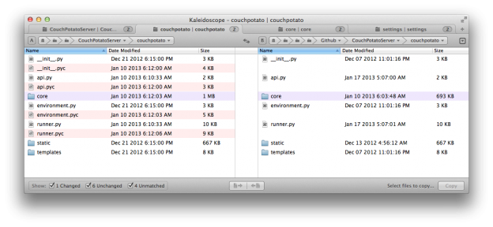

Alfred 2 Workflows
=================
Workflows for [Alfred 2](http://www.alfredapp.com/).

Add Date To Filename
---
Adds the file creation date to the filename before the suffix:

Item Name.xxx -> Item Name-20130523.xxx

Compare In Kaleidoscope
---
Compares selected Finder items in [Kaleidoscope 2](http://cl.ly/NoMY).

My review of [Kaleidoscope 2](http://cl.ly/Nn0J).

Add Date And Time Before Filename
---
Adds the *current* date and time to the file before the filename:

Item Name.xxx -> 2013-03-25 08-46 PM Item Name.xxx

Cheaters
---
Run [Cheaters](https://github.com/ttscoff/cheaters) by [Brett Terpstra](http://brettterpstra.com/).

## Feedback

Suggestions/improvements [welcome](https://github.com/jamesstout/Alfred2-Workflows/issues)!

## Thanks to…

* [Brett Terpstra](http://brettterpstra.com/) for sharing his [Cheaters system](https://github.com/ttscoff/cheaters).
* [Nicolas Gallagher](http://nicolasgallagher.com/) and his [dotfiles utils functions](https://github.com/necolas/dotfiles) 
* [Marko Kaestner](https://github.com/markokaestner) for his [BashWorkflowHandler](https://github.com/markokaestner/alfred2/tree/master/workflows/BashWorkflowHandler).
* [Black Pixel](http://www.blackpixel.com/) for [Kaleidoscope 2](http://www.kaleidoscopeapp.com/).
* And of course, The Pepperrells, for creating [Alfred](http://www.alfredapp.com/).

